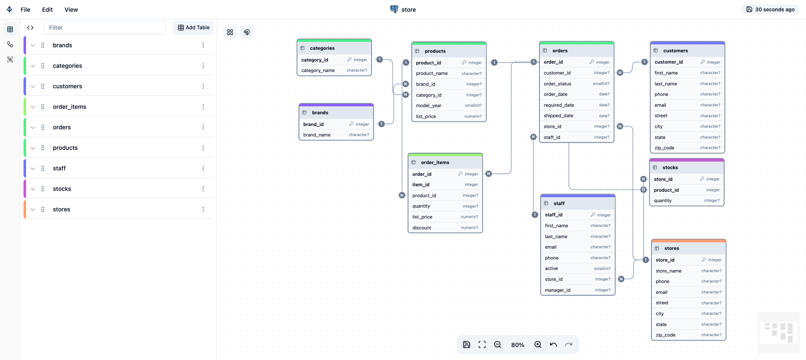

# Virelyn


From your CI pipeline, create a visual database schema, editable and ready to evolve.

- Open-source database diagrams (ERD - Entity Relational Diagram) editor
- Integrates with your continuous integration pipeline
- Avoid ERD rot
- Cloud based
- Your database password remains with you!

[Try Now!](https://db.virelyn.com?ref=github_readme) •
[Database Examples](https://db.virelyn.com/examples?ref=github_readme)

## Licence


Virelyn is based on ChartDB and distributed under the same AGPL licence. 
We will regularly merge back core diagramming changes.

Current supported ChartDB version is `1.11.0`.



### Virelyn

Virelyn is a powerful, web-based database diagramming editor and CI integration tool.
Instantly visualize your database schema with a single **"Smart Query."** Customize diagrams, export SQL scripts, and access all features—no account required. Experience seamless database design here.

**What it does**:

- **Instant Schema Import**
  Run a single query to instantly retrieve your database schema as JSON. This makes it incredibly fast to visualize your database schema, whether for documentation, team discussions, or simply understanding your data better.

- **AI-Powered Export for Easy Migration**
  Our AI-driven export feature allows you to generate the DDL script in the dialect of your choice. Whether you're migrating from MySQL to PostgreSQL or from SQLite to MariaDB, Virelyn simplifies the process by providing the necessary scripts tailored to your target database.
- **Interactive Editing**
  Fine-tune your database schema using our intuitive editor. Easily make adjustments or annotations to better visualize complex structures.

### Supported Databases

- PostgreSQL (Regular, Supabase or Timescale)
- MySQL
- SQL Server
- MariaDB
- SQLite (Regular or Cloudfare D1)
- Oracle
- CockroachDB
- ClickHouse

## Try it in your continuous integration pipeline

1. Go to [https://db.virelyn.com](https://db.virelyn.com?ref=github_readme)
2. Click "Go to app"
3. Choose the database that you are using.
4. Take the magic query and run it in your database.
5. Copy and paste the resulting JSON set into Virelyn.
6. Enjoy Viewing & Editing!

## Getting Started

Use the [cloud version](https://db.virelyn.com?ref=github_readme) or deploy locally:

### How To Use

```bash
npm install
npm run dev
```

### Build

```bash
npm install
npm run build
```
